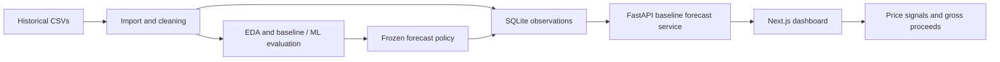

# AgriSense

AgriSense analyzes historical mandi prices and generates next-observation price estimates for selected Gujarat markets. It combines a reproducible research pipeline, FastAPI backend and Next.js dashboard with market comparison and quantity-based gross proceeds calculations.

**The estimate is for the next reported market observation, not tomorrow, a 7-day/30-day horizon or an arbitrary future date.** Records are historical, not live prices. The application does not guarantee where or when to sell.

## What AgriSense Does

Choose a commodity and exact market series, inspect price history, generate an estimate, and compare its price and gross proceeds with other supported series. Dates, methods, fallback behavior and historical error remain visible.

### Key Features

- CSV import with provenance, deterministic cleaning, validation and exploratory analysis.
- Chronological baseline benchmarks, historical features, classical ML experiments and robustness evaluation.
- SQLite persistence for observations, policies, forecasts and research metadata.
- Typed forecast/history APIs, saved forecasts and a historical price chart.
- Neutral price signals, variety/grade-aware market comparisons and a gross proceeds calculator.
- Deterministic summaries, error/empty states, regression tests and CI.

## System Architecture



Research and model training run offline. Production requests read the active baseline policy; they do not train or invoke experimental ML. Each request opens its own database connection. Comparison forecasts are read-only; only **Generate forecast** saves a result, and equivalent requests reuse it.

## Data Pipeline

Source: [Daily Commodity Prices India, published by Manas Khandelwal on Kaggle](https://www.kaggle.com/datasets/khandelwalmanas/daily-commodity-prices-india). The supplied `2024.csv` and `2025.csv` are preserved unchanged. See [data sources](docs/DATA_SOURCES.md), [profile](reports/data/DATA_PROFILE.md) and [cleaning report](reports/data/CLEANING_REPORT.md).

| Scope | Verified value |
| --- | --- |
| State / commodities | Gujarat / Onion, Potato, Tomato |
| Cleaned observations | 39,630 |
| Historical series | 229 |
| Overall cleaned date range | 2024-01-01 to 2025-12-29 |
| Production-supported series | 9 selected candidates |
| Price unit | INR/quintal (one quintal = 100 kg) |

An exact series is **state + district + market + commodity + variety + grade**. Varieties and grades stay separate. Missing dates are not zero and are not filled to invent daily coverage. The overall date range does not mean every series spans two complete years; supported series currently end in November 2025. The dataset title does not guarantee complete historical coverage.

Import, profiling, cleaning, EDA, baseline evaluation, feature engineering, ML experiments and robustness evaluation are separate scripts in `scripts/`. Their commands and provenance rules are documented in [Day 2](docs/DAY_02.md), [Day 3](docs/DAY_03.md), [EDA](reports/data/EDA_REPORT.md), [baselines](reports/data/BASELINE_FORECAST_REPORT.md), [features](reports/data/FEATURE_ENGINEERING_REPORT.md), [ML](reports/data/ML_MODEL_REPORT.md) and [Day 8](docs/DAY_08.md).

## Forecasting Approach

The unchanged [forecast policy](configs/forecast_policy.json) selects **7 naive and 2 rolling-mean-7** series:

- **Naive:** latest valid observed modal price.
- **Rolling mean 7:** mean of the latest seven observations, not seven calendar days.
- Fewer than seven observations but at least one: naive fallback.
- No valid history: unavailable/null, never a fabricated INR 0.

### Why Baselines Are Used in Production

| Historical evaluation | Macro test MAE, INR/quintal |
| --- | ---: |
| Day 5 validation-selected baselines | 119.55 |
| Day 7 validation-selected ML | 136.20 |

Baselines won on **9/9 series**. ML remains `experimental_not_selected`; retaining the stronger observed baseline results is intentional. Day 8 robustness checks retained the policy. These are previously examined historical test periods, not a fresh untouched holdout. MAE describes past forecast error, not a guaranteed range for a new estimate. See the [ML comparison](reports/data/ml_baseline_comparison.csv) and [robustness report](reports/data/ROBUSTNESS_EVALUATION_REPORT.md).

## Supported Markets / Commodities

All entries are in Gujarat and grade FAQ. Exact identifiers are available from the supported-series API and policy file.

| District / market | Commodity / variety | Method |
| --- | --- | --- |
| Dahod / Dahod (Veg. Market) | Onion / Onion | rolling_mean_7 |
| Dahod / Dahod (Veg. Market) | Potato / Potato | rolling_mean_7 |
| Dahod / Dahod (Veg. Market) | Tomato / Tomato | naive |
| Kheda / Kapadvanj | Onion / Other; Potato / Other | naive (2 series) |
| Navsari / Bilimora | Onion / Nasik; Potato / Other; Tomato / Other | naive (3 series) |
| Navsari / Navsari | Tomato / Other | naive |

The 229 historical series are not all forecast-supported. Unsupported identities do not receive an arbitrary model.

## Project Structure

| Folder | Purpose |
| --- | --- |
| `backend/` | FastAPI routes, response contracts and forecast service |
| `frontend/` | Next.js dashboard, typed client and frontend tests |
| `database/` | SQLite schema v1 and repository |
| `scripts/` | Data/research workflows, imports and system verification |
| `configs/` | Data configuration and frozen production policy |
| `data/` | Local raw, intermediate, canonical and SQLite files |
| `ml/` | Local experimental model artifacts |
| `reports/` | Scientific metrics, metadata and figures |
| `docs/` | Day-by-day evidence and project documentation |
| `tests/` | Python tests and small synthetic fixtures |
| `.github/workflows/` | Repository CI checks |

## Tech Stack

Python 3.13, FastAPI, Pydantic, standard-library SQLite, pandas, NumPy, scikit-learn and Matplotlib; Node.js 24, Next.js 16, React 19, TypeScript and Tailwind CSS. Tests use Python `unittest` and Node's built-in test runner. GitHub Actions provides CI configuration. The existing hosted project addresses use Vercel; current hosted functionality is not freshly verified.

## Setup

Use Python 3.13, Node.js 24 and Git. The commands below are PowerShell commands, run from the repository root unless a different directory is shown. They use the virtual environment executable directly, so activation is optional.

```powershell
git clone https://github.com/Krish290107/agrisense.git
cd agrisense
py -3.13 -m venv .venv
.\.venv\Scripts\python.exe -m pip install -r backend/requirements.txt -r requirements-data.txt
```

If needed, the existing `scripts/setup-node.ps1` and `scripts/use-node.ps1` support a project-local Node installation; see [Day 1](docs/DAY_01.md). With system Node 24 installed, those scripts are unnecessary. On Unix, create the environment with `python3.13 -m venv .venv`, use `.venv/bin/python` in place of the Windows executable, and use `npm` instead of `npm.cmd`.

### Backend Setup and Environment

Copy example settings only when no local settings already exist:

```powershell
if (-not (Test-Path backend/.env)) { Copy-Item backend/.env.example backend/.env }
if (-not (Test-Path frontend/.env.local)) { Copy-Item frontend/.env.example frontend/.env.local }
```

| Variable | Location / default | Meaning |
| --- | --- | --- |
| `ALLOWED_ORIGINS` | `backend/.env`; `http://localhost:3000,http://127.0.0.1:3000` | Explicit browser origins; no paths, credentials or wildcards |
| `DATABASE_URL` | Backend; `sqlite:///data/agrisense.db` | Local SQLite path, relative to repository root unless absolute |
| `NEXT_PUBLIC_API_BASE_URL` | `frontend/.env.local`; `http://127.0.0.1:8000` | Public backend base URL, without credentials/query/fragment |

The API loads `backend/.env`; existing process variables take priority. Standalone database scripts use the process environment or their explicit CLI option, not that dotenv file. Restart services after configuration changes; public frontend variables are also embedded during production build. Never commit `.env` files or place secrets in `NEXT_PUBLIC_` variables. See [backend example](backend/.env.example) and [frontend example](frontend/.env.example).

### Database Initialization

**A fresh source clone does not include the real dataset, model binary or SQLite file.** Tests and the fixture smoke check work without them; the real dashboard needs populated storage.

For the existing project workspace, retain the original raw CSVs, immutable import/provenance bundles, canonical `data/processed/market_prices_clean.csv`, local processed artifacts and `ml/models/agrisense_price_model.joblib`. The Day 9 initializer checks the frozen artifact hashes as well as tracked reports/configuration. On another computer, restore the matching project artifacts from the original workspace before initializing. Merely creating an empty database or downloading a newer Kaggle snapshot does not reproduce the frozen experiment.

```powershell
.\.venv\Scripts\python.exe scripts/init_database.py
```

This initializes schema v1 and imports observations, policies, experimental model metadata and evaluation summaries into ignored `data/agrisense.db`. Importing identical inputs twice is safe and preserves existing forecasts. Do not create SQL tables manually. For a different local destination, pass `--database-url sqlite:///data/alternate.db` and configure the backend to use the same URL.

For source-data preparation, place the original `2024.csv` and `2025.csv` in `data/raw/`, then use the documented pipeline:

```powershell
.\.venv\Scripts\python.exe scripts/import_market_data.py data/raw --source kaggle_daily_india --kind historical --date-format "%Y-%m-%d"
.\.venv\Scripts\python.exe scripts/profile_market_data.py --state Gujarat --commodities Onion Potato Tomato
.\.venv\Scripts\python.exe scripts/clean_market_data.py
```

These three commands prepare canonical data; they do not recreate every research/model artifact required by the frozen Day 9 import. The linked research guides explain the remaining stages. Existing completed results should be reused. Hash mismatches indicate different inputs or implementations: restore the matching artifacts rather than bypassing checks or overwriting published metrics. Raw data and research artifacts are large and intentionally ignored; a source-only clone is sufficient for CI, not a complete real-data distribution.

### Frontend Setup

```powershell
cd frontend
npm.cmd ci
cd ..
```

`npm.cmd` avoids PowerShell's `npm.ps1` execution-policy issue. Installation uses `package-lock.json`.

## Running the Application

Open two terminals at the repository root.

**Backend:**

```powershell
.\.venv\Scripts\python.exe -m uvicorn backend.app:app --reload --host 127.0.0.1 --port 8000
```

**Frontend:**

```powershell
cd frontend
npm.cmd run dev
```

Open [the dashboard](http://localhost:3000), [API health](http://127.0.0.1:8000/health) and [interactive API docs](http://127.0.0.1:8000/docs). Health returns `{"status":"ok","service":"agrisense-api"}`; it checks reachability, not whether the real database is ready. Stop a service with Ctrl+C.

If the frontend uses a different port, its exact origin must be allowed by the backend. Database errors should be resolved using the initialization workflow; do not substitute zero prices. Connection errors have retry controls. A successful direct health response alone does not prove browser CORS works.

For a local production build, stop the frontend development server, then run `npm.cmd run build` and `npm.cmd start` inside `frontend/`. Keep the backend running separately.

## Using the Dashboard

1. Open the dashboard and check **Backend connected**.
2. Choose Onion, Potato or Tomato, then the exact market/variety/grade series.
3. Inspect recent history, latest modal price and its actual observation date.
4. Click **Generate forecast**. Read the method used, history cutoff and any fallback.
5. Review recent observations and saved forecasts; unchanged requests reuse the saved estimate.
6. In **Market decision support**, read the latest-versus-estimate difference and percentage.
7. Enter a positive quantity in quintals. Compare latest-price and forecast-price gross proceeds.
8. Review **Estimated price comparison**, including variety, grade, record date, method and historical MAE for each series.
9. Read the summary and limitations before interpreting a comparison as useful information.

For example, the verified Dahod Potato record on 3 November 2025 is INR 1,500/quintal and its estimate is INR 1,428.571429: -4.76%. Ten quintals correspond to INR 15,000.00 versus INR 14,285.71 gross proceeds, a difference of INR -714.29. The calculator multiplies full-precision prices before currency rounding. This is a historical demonstration, not a current market quote.

## Forecast API

Base URL locally: `http://127.0.0.1:8000`. Prices are decimal strings in INR/quintal. Identities are exact series IDs from discovery; missing values are null.

| Method / route | Purpose |
| --- | --- |
| `GET /health` | Service reachability |
| `GET /api/v1/forecast/series` | Active supported series |
| `GET /api/v1/forecast/series/{series_id}/history?limit=30` | Latest observations, chronological; limit 1-365 |
| `POST /api/v1/forecast` | Generate/save next-observation estimate |
| `GET /api/v1/forecast/series/{series_id}/forecasts?limit=20` | Saved results, newest first; limit 1-100 |
| `GET /api/v1/decision/markets?series_id={series_id}` | Non-persisting supported-market comparison |

Discover series and generate Dahod Potato with PowerShell:

```powershell
Invoke-RestMethod http://127.0.0.1:8000/api/v1/forecast/series
Invoke-RestMethod -Method Post -Uri http://127.0.0.1:8000/api/v1/forecast -ContentType 'application/json' -Body '{"series_id":"314b4dfffac5b7bc"}'
```

Selected fields from the verified response (not the full schema):

```json
{"status":"ok","forecast_type":"next_observation","prediction":"1428.571429","method_used":"rolling_mean_7","fallback_used":false,"history_observations_used":7,"history_cutoff_date":"2025-11-03","latest_observed_price":"1500.0"}
```

The optional `as_of_date` applies the current policy to records on/before an ISO date, capped at today UTC. It is a history cutoff, not a target forecast date. Unknown series return 404; malformed inputs return 422; unavailable storage/policy returns sanitized 503. Known unsupported or empty-history forecast requests return explicit domain statuses with null predictions; unsupported decision requests return 422. See `/docs` for complete response contracts.

## Decision Support

Price difference is estimate minus latest modal price; percentage divides this by the latest price. Absolute change below 2% is **Near**; otherwise the signal is **Above** or **Below**. The fixed threshold was not tuned against historical outcomes.

Comparisons prefer matching commodity, variety and grade across multiple supported markets. If exact matches are limited, a broader commodity comparison displays a warning. Estimates sort descending with deterministic series-ID ties; unavailable estimates appear last. A higher price does not establish the best place to sell.

Gross proceeds = quantity in quintals multiplied by price. **Gross proceeds are not profit:** transport, handling, market access and other costs are not modeled. Invalid, nonfinite, zero or negative quantities and missing prices remain unavailable. Summaries are deterministic descriptions of actual values, without invented weather/supply/demand explanations. Historical MAE is not a confidence interval.

## Testing

From the repository root:

```powershell
.\.venv\Scripts\python.exe -m unittest discover -s tests
.\.venv\Scripts\python.exe -m pip check
.\.venv\Scripts\python.exe scripts/verify_system.py
```

The smoke command launches a temporary fixture database/API, exercises the actual frontend client over HTTP, checks calculation/persistence behavior and cleans up. It requires Node 24 but no real data or running services.

With the full matching local artifacts available, optionally verify two imports and the real-data HTTP flow in a disposable database:

```powershell
.\.venv\Scripts\python.exe scripts/verify_system.py --rebuild
```

Frontend checks:

```powershell
cd frontend
npm.cmd test
npm.cmd run typecheck
npm.cmd run lint
npm.cmd run build
cd ..
```

Final local verification: **91 Python tests, 11 frontend tests**, typecheck, lint, production build and HTTP/OpenAPI smoke passed. [CI](.github/workflows/ci.yml) runs isolated tests and fixture smoke without ignored data. Workflow configuration is checked locally; hosted execution has not been observed. [Day 13](docs/DAY_13.md) and [Day 14](docs/DAY_14.md) record evidence and boundaries.

## Deployment

Previously user-confirmed project addresses are retained for reference:

- [Frontend: agrisense-web-v2](https://agrisense-web-v2.vercel.app)
- [Backend: agrisense-api](https://agrisense-4lqq.vercel.app)

The Day 14 web checks could not access these addresses. This does not establish an outage, and **current hosted dashboard/forecast functionality is not freshly verified**. No deployment settings were changed. There is no tracked Vercel deployment configuration to reproduce remote project settings automatically.

The frontend uses the standard Next.js build and must receive the correct public backend URL at build time. The backend uses `backend.app:app`, backend requirements, explicit frontend origins and a populated database path. Environment names are listed above. A hosted health response alone would not verify data availability or end-to-end browser operation.

**Local SQLite is suitable for local/project use, not durable serverless production persistence.** The ignored local database is not automatically included in deployment. Durable hosted production persistence requires an external database and an appropriate repository adapter; the current code supports only local SQLite URLs. A persistent-disk server can support a limited local-file deployment, but this project does not provision one. Do not describe the existing serverless URLs as a verified durable forecast service.

## Current Limitations

- Only selected Gujarat Onion/Potato/Tomato markets; nine production-supported series.
- Roughly two years of irregular historical data, incomplete per-series coverage and no live feed.
- Next-observation estimates only; price shocks remain difficult.
- Historical test dates were previously examined; ML did not outperform baselines.
- No arrivals, weather or demand feeds; comparisons do not guarantee selling outcomes.
- Frozen real-data rebuild needs ignored original artifacts; source-only clones support fixture verification.
- Local SQLite is not durable serverless storage; hosted CI and visual browser checks remain unverified.
- Existing dependency caveats are recorded in [progress](docs/PROGRESS.md); final checks are not a comprehensive security audit.

## Future Improvements

Longer data history, arrivals/weather features, nearby-market signals, a genuinely fresh out-of-time holdout and further validated modeling experiments could improve evidence. Durable external storage, broader coverage and separately validated fixed-horizon forecasts are future work, not implemented features.

## Project Progress / Final Status

Days 1-14 local implementation, verification and README-based release documentation are complete. The project is ready for academic submission/source review with the documented data-distribution and hosting limitations. Hosted CI execution and visual/deployment confirmation are separate outstanding verification items, not claimed passes. This README is the complete usage/demo guide; no video is required.

See [final release record](docs/DAY_14.md) and [historical progress](docs/PROGRESS.md). Earlier day records describe the state at that time and do not supersede this final guide.

## Author / Academic Context

**Krishkumar** | **Roll No. 2401CS83** | **IIT Patna**
Repository: https://github.com/Krish290107/agrisense
