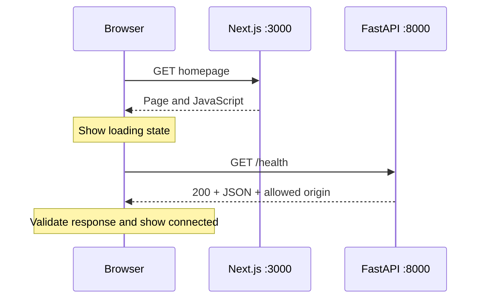

# Day 1: the local foundation

**Project owner:** Krishkumar | **Roll No:** 2401CS83 | **Institution:** IIT Patna

**GitHub repository:** https://github.com/Krish290107/agrisense

The goal is to run a web page and an API locally and prove that the browser can communicate with the API. [PROGRESS.md](PROGRESS.md) records the checks actually performed; this guide explains the implementation.

## Tools and their jobs

| Tool | Job in this project |
| --- | --- |
| Node.js 24 LTS and npm | Run Next.js and install frontend packages |
| Next.js App Router and React | Organize and render the web page |
| TypeScript | Check frontend types before running |
| Tailwind CSS | Style the responsive interface |
| ESLint | Find frontend code-quality issues |
| Python 3.13 | Run backend code in the root `.venv` |
| FastAPI | Define the API and generate interactive `/docs` |
| Uvicorn | Serve FastAPI over HTTP during local development |
| python-dotenv | Read the backend's local `.env` file |
| Git | Track source and documentation changes |

## Files to understand first

| Path | Purpose |
| --- | --- |
| `backend/app.py` | Exports `app`, configures CORS, and defines `GET /health` |
| `backend/requirements.txt` | Pinned dependencies needed for today's API |
| `backend/.env.example` | Safe example of allowed browser origins |
| `backend/.python-version` | Python version selection for future hosting |
| `frontend/src/app/` | App Router page, root layout, and styles |
| `frontend/package.json` | Frontend scripts and package declarations |
| `frontend/package-lock.json` | Reproducible npm dependency resolution |
| `frontend/.env.example` | Example browser-facing API address |
| `scripts/setup-node.ps1` | Install and verify the project-local Node.js release |
| `scripts/use-node.ps1` | Select project-local Node.js in the current terminal |
| `.gitignore` | Keep local settings and generated files out of Git |
| `docs/PROGRESS.md` | Installed versions, verification evidence, and next task |

Actual configuration files (`backend/.env` and `frontend/.env.local`), `.venv/`, `.tools/`, `frontend/node_modules/`, and build caches stay local. Example environment files and dependency lockfiles belong in Git.

The future folders have placeholders so Git can preserve their structure. No data pipeline, notebooks, database schema, model, or continuous-integration workflow is implemented on Day 1.

## Request and response flow



The browser reads `NEXT_PUBLIC_API_BASE_URL` from the compiled frontend configuration and requests `/health` directly. A timeout prevents an unavailable API from leaving the page waiting forever. The frontend reports a failed connection for a network, timeout, HTTP, or unexpected-response error. Retry starts another request.

The expected response is:

```json
{"status":"ok","service":"agrisense-api"}
```

The two servers use different ports, so the browser treats them as different origins. CORS tells the browser which page origins may read API responses. The backend allows `http://localhost:3000` and `http://127.0.0.1:3000` by default. `ALLOWED_ORIGINS` can replace this comma-separated list.

Loading `.env` using the directory containing `app.py` makes configuration independent of the terminal's current directory. Existing host environment variables take precedence over values in the file. This also supports using `backend/` as the future Vercel project root.

The page does not call the local API during its production build. This is why the build can succeed without a running backend. Next.js embeds `NEXT_PUBLIC_` values into browser JavaScript at build time; hosted API-address changes require a new build. See [Next.js environment variables](https://nextjs.org/docs/app/guides/environment-variables).

## What today's checks prove

- Lint checks the frontend against its ESLint rules.
- Type checking catches incompatible TypeScript values.
- A production build verifies that Next.js can compile the app.
- HTTP checks for `/health` and `/docs` confirm backend routes are reachable.
- Loading the homepage checks frontend serving.
- A browser health check also checks CORS and client-side JavaScript; HTTP commands alone cannot prove these.
- Git ignore checks confirm local credentials, dependencies, and generated files will be excluded from a normal commit.

Follow [README.md](../README.md) for commands and [PROGRESS.md](PROGRESS.md) for the actual outcomes. Day 2 begins with finding and documenting a real agricultural price data source; it is not part of this implementation.
