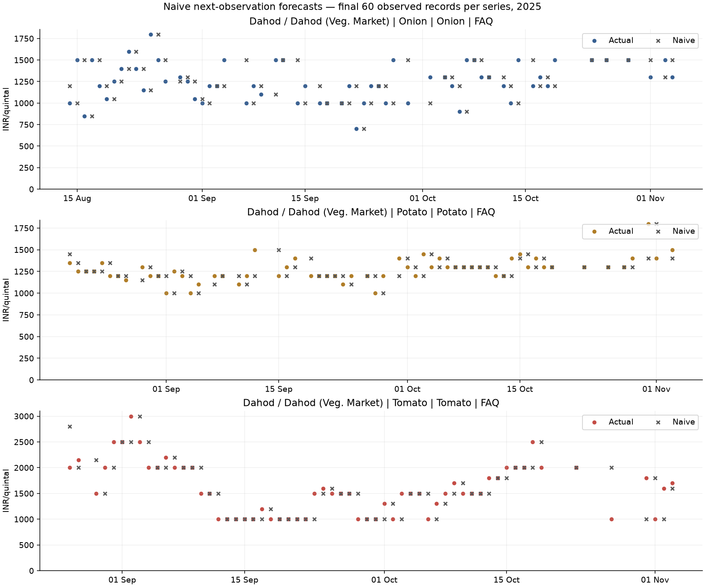
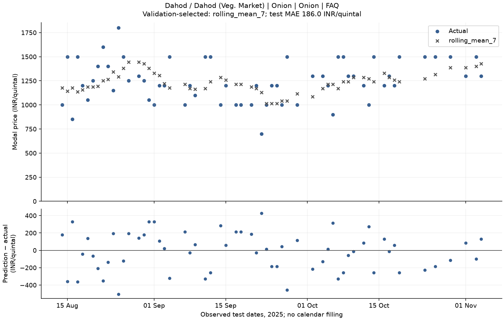
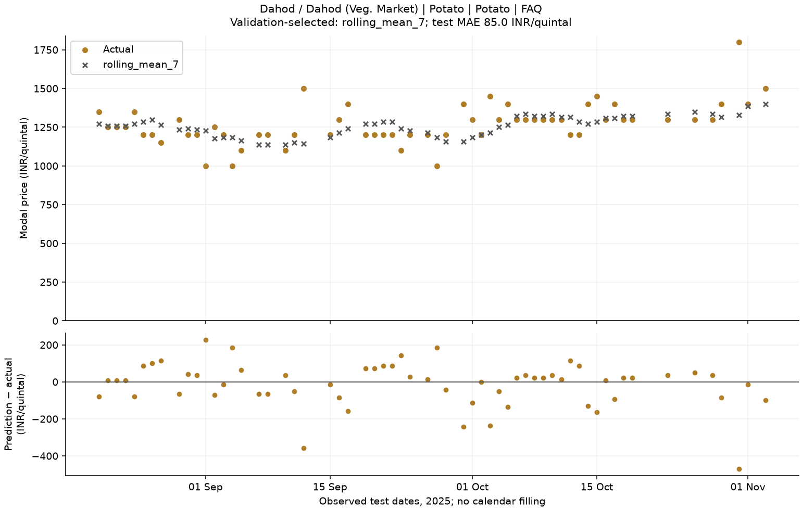
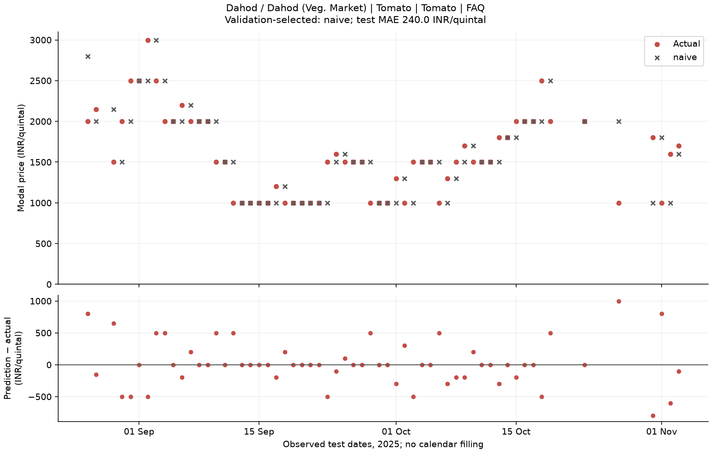
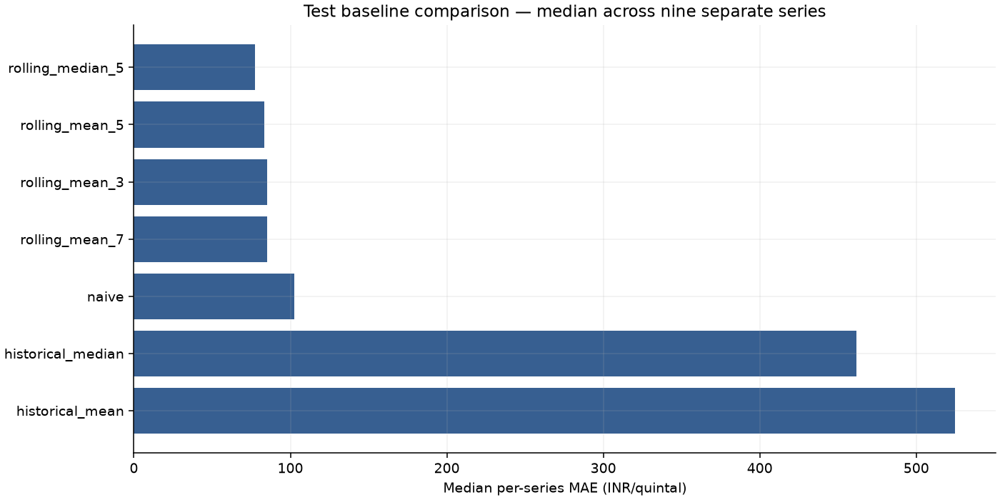
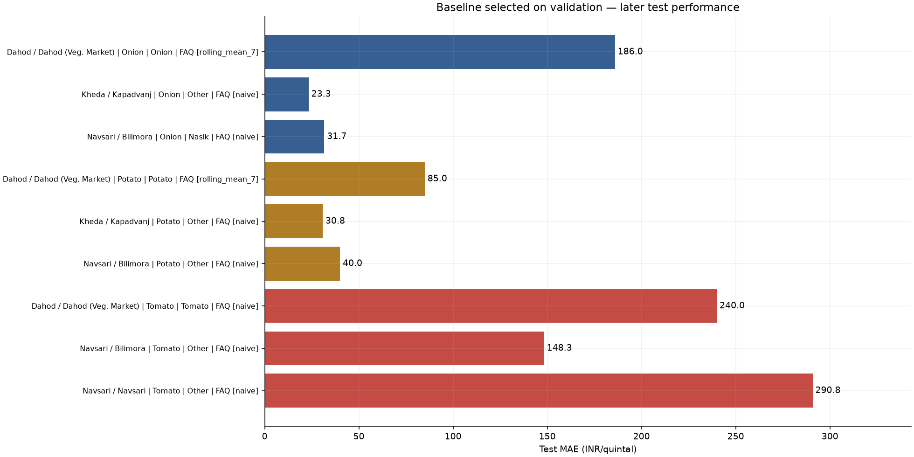
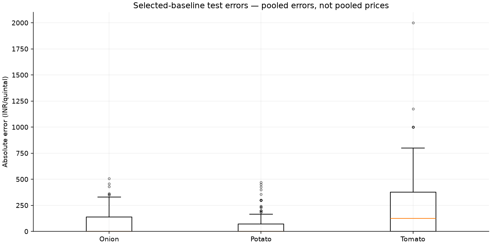
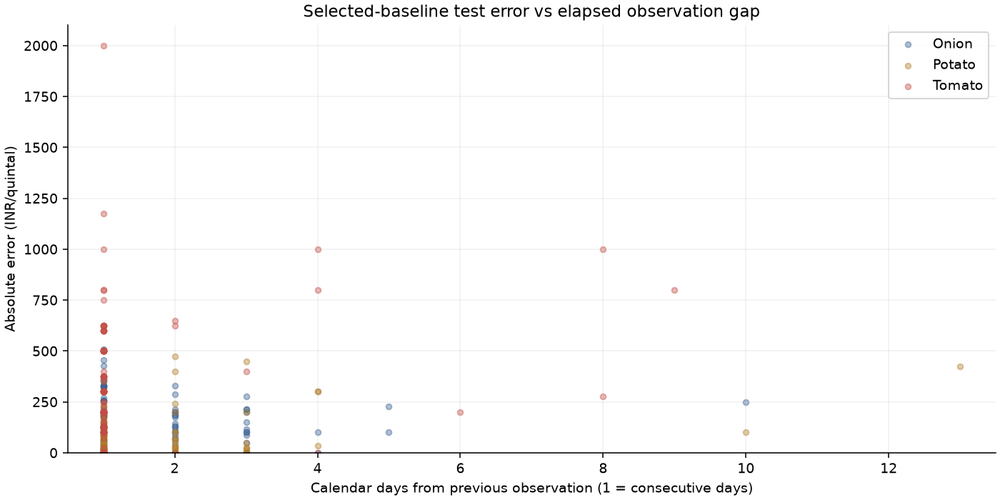

# Day 5: forecasting baselines and chronological backtesting

Krishkumar | 2401CS83 | IIT Patna

Repository: https://github.com/Krish290107/agrisense

## Scope and evaluation

9 exact Day 4 candidate series; 7,560 forecast/actual comparisons from 1080 observed target records across seven baselines. Prices are INR/quintal. Full six-field identities come from forecast_candidates.csv and are checked against readiness, EDA summary and cleaned data.

Each series uses its final 120 observations: first 60 for validation, final 60 for test. This leaves 406–513 initial observations in the supplied candidates. Forecasts expand the history one observed record at a time. Earlier validation/test actuals become available only after their forecast is scored. Every forecast uses strictly earlier modal prices; no current/future min/max, target, date gap or exogenous variable enters the model.

The horizon is the next observed record, not tomorrow or a fixed calendar interval. Target dates and elapsed gaps are attached retrospectively for scoring, not assumed known at the forecast origin. Each series has its own dates; baseline_splits.csv freezes boundaries and sample counts. No missing observations are created or filled.

Model selection uses validation MAE, then validation RMSE, then baseline name as a deterministic tie-break. The selected model is frozen before test. best_baselines.csv contains that model's later test scores, not a model chosen by looking at test scores. baseline_metrics.csv additionally ranks all models separately within each phase; test rank 1 is a retrospective diagnostic, not an unbiased model-selection result.

## Baselines and metrics

Naive = previous observed price. Historical mean/median use all preceding observations. Rolling means use the previous 3, 5 or 7 observations; rolling median uses the previous 5. Windows are fixed in advance, count actual records and are small relative to available history. No seasonal baseline: each identity spans under two years, observation intervals are irregular and there are too few repeated seasonal cycles to justify a weekly/monthly/yearly rule.

MAE = mean absolute error; RMSE = square root of mean squared error. Both are INR/quintal; MAE 250 means an average absolute miss of 250 INR/quintal over scored targets. sMAPE = 100 × mean(2|prediction−actual|/(|actual|+|prediction|)), range 0–200%; a zero/zero pair contributes 0. Canonical actuals and forecasts here are positive. Scores use forecast pairs only, never training observations.

## Validation-selected baseline per series

| Series (Gujarat) | Selected baseline | Validation MAE | Test MAE | Test RMSE | Test sMAPE % | Test rank |
| --- | --- | --- | --- | --- | --- | --- |
| Dahod / Dahod (Veg. Market) / Onion / Onion / FAQ | rolling_mean_7 | 218.81 | 185.95 | 222.03 | 15.06 | 3 |
| Kheda / Kapadvanj / Onion / Other / FAQ | naive | 13.33 | 23.33 | 64.87 | 1.96 | 1 |
| Navsari / Bilimora / Onion / Nasik / FAQ | naive | 33.33 | 31.67 | 71.88 | 2.3 | 1 |
| Dahod / Dahod (Veg. Market) / Potato / Potato / FAQ | rolling_mean_7 | 97.62 | 85.0 | 120.54 | 6.67 | 4 |
| Kheda / Kapadvanj / Potato / Other / FAQ | naive | 6.67 | 30.83 | 96.57 | 2.37 | 1 |
| Navsari / Bilimora / Potato / Other / FAQ | naive | 10.0 | 40.0 | 103.28 | 2.02 | 1 |
| Dahod / Dahod (Veg. Market) / Tomato / Tomato / FAQ | naive | 335.0 | 240.0 | 357.89 | 15.11 | 1 |
| Navsari / Bilimora / Tomato / Other / FAQ | naive | 248.33 | 148.33 | 247.32 | 8.04 | 1 |
| Navsari / Navsari / Tomato / Other / FAQ | naive | 268.75 | 290.83 | 458.3 | 14.8 | 1 |

## Aggregate comparison

| baseline | mean_mae | median_mae | median_rmse | mean_smape | phase_wins | validation_selections |
| --- | --- | --- | --- | --- | --- | --- |
| rolling_median_5 | 158.843 | 77.5 | 134.164 | 9.867 | 2 | 0 |
| rolling_mean_5 | 159.333 | 83.5 | 118.666 | 9.885 | 0 | 0 |
| rolling_mean_3 | 142.963 | 85.0 | 117.812 | 9.007 | 0 | 0 |
| rolling_mean_7 | 175.747 | 85.0 | 127.108 | 10.757 | 0 | 2 |
| naive | 126.204 | 102.5 | 142.156 | 8.142 | 7 | 7 |
| historical_median | 444.054 | 461.667 | 565.538 | 26.662 | 0 | 0 |
| historical_mean | 644.014 | 524.608 | 639.968 | 37.231 | 0 | 0 |

These are equal-series summaries of test metrics, not a concatenated price series. phase_wins counts retrospective test winners; validation_selections counts models chosen earlier. Ties are broken deterministically, not treated as evidence of meaningful superiority. Selected-baseline test mean MAE: 119.55; median MAE: 85.00 INR/quintal.

## Error and gap analysis

| Series | Date | Actual | Prediction | Abs error | Gap days | Observed move % |
| --- | --- | --- | --- | --- | --- | --- |
| Navsari / Navsari / Tomato / Other / FAQ | 2025-08-25 | 2500.0 | 4500.0 | 2000.0 | 1 | -44.4 |
| Navsari / Navsari / Tomato / Other / FAQ | 2025-10-12 | 2500.0 | 1325.0 | 1175.0 | 1 | 88.7 |
| Dahod / Dahod (Veg. Market) / Tomato / Tomato / FAQ | 2025-10-27 | 1000.0 | 2000.0 | 1000.0 | 4 | -50.0 |
| Navsari / Navsari / Tomato / Other / FAQ | 2025-08-24 | 4500.0 | 3500.0 | 1000.0 | 1 | 28.6 |
| Dahod / Dahod (Veg. Market) / Tomato / Tomato / FAQ | 2025-08-26 | 2000.0 | 2800.0 | 800.0 | 1 | -28.6 |

| commodity | comparisons | mae | rmse | smape |
| --- | --- | --- | --- | --- |
| Onion | 180 | 80.31746031746033 | 139.84624696113815 | 6.440538672973255 |
| Potato | 180 | 51.94444444444444 | 107.27396739951708 | 3.684159112440708 |
| Tomato | 180 | 226.38888888888889 | 364.82491995780964 | 12.647879679162497 |

Largest selected-model misses are shown above, with the actual price move from the previous observation. A large observed move is not proof of an erroneous source value. All observations, including genuine spikes, remain. baseline_error_examples.csv includes the top three errors for every series.

Selected-baseline pooled test MAE is 112.42 over 447 consecutive-day targets versus 153.84 over 93 longer-gap targets. This observed association is not causal or adjusted for commodity/market composition. The largest individual miss occurs at an elapsed gap of 1 day(s), so long gaps alone do not explain spikes. 54.3% of test targets repeat their preceding observed price; this favors persistence but does not prove the source reporting process is unchanged.

| commodity | gap_band_days | comparisons | mae | rmse |
| --- | --- | --- | --- | --- |
| Onion | 1 | 138 | 70.109 | 137.407 |
| Onion | 2–3 | 37 | 110.907 | 145.192 |
| Onion | 4–7 | 4 | 107.143 | 134.392 |
| Onion | 8+ | 1 | 250.0 | 250.0 |
| Potato | 1 | 140 | 39.821 | 81.698 |
| Potato | 2–3 | 35 | 74.694 | 147.847 |
| Potato | 4–7 | 3 | 211.905 | 245.815 |
| Potato | 8+ | 2 | 262.5 | 308.727 |
| Tomato | 1 | 169 | 207.101 | 340.455 |
| Tomato | 2–3 | 4 | 418.75 | 493.235 |
| Tomato | 4–7 | 4 | 500.0 | 648.074 |
| Tomato | 8+ | 3 | 691.667 | 756.224 |

Gap days are elapsed days (1 means consecutive dates), unlike Day 4's count of missing days between dates. Gap buckets are retrospective diagnostics; sample sizes and different series/price levels confound comparisons. Sparse long-gap buckets cannot establish that elapsed time causes error. Compare the companion naive rows in baseline_gap_errors.csv before generalizing.

## Figures

Representative plots use the first exact candidate per commodity in deterministic identity order; selection does not depend on test error. Points are observed dates; no interpolated price line is a generated forecast.

## Reproduction and future benchmark contract

Run `.\.venv\Scripts\python.exe scripts/run_baselines.py`. Summary records input/code hashes, software versions, fixed policy and output hashes. Prediction-level results are local at reports/data/local/baseline_predictions.csv; compact metrics/splits/reports are shareable. Repeated execution with the same inputs and environment is deterministic. The existing summary prevents silently overwriting scores after an input, policy or implementation change; use a separately reviewed/versioned experiment for a changed benchmark.

Future models must use the same exact identities, target dates, one-observation horizon, history availability and metric definitions. Fit transforms/features only on past training observations, tune on validation, then score the same test dates. Keep Day 5 scores unchanged. Once later development uses these test findings, this test is no longer a fresh unbiased holdout; reserve additional untouched data for a final generalization claim.

## Limitations and Day 6

Only the strongest nine candidates are evaluated; Day 4 selected them using full-history coverage/variability, so the cohort is retrospective and not representative of all 229 series. No forecast computation uses future targets, but this cohort-selection bias limits generalization. Approximately two source years and less than two years per identity do not establish stable seasonality. The final 60 observations cover different calendar dates per market and emphasize late-2025 conditions. Historical endpoints are stale; no live forecasting capability is claimed. There is no publication-time metadata, so evaluation assumes earlier recorded observations were available without later revision. Weather, arrivals, demand and events are absent. Baseline performance is not production readiness.

Day 6 should build strictly historical per-series features with explicit availability and leakage tests, retaining the fixed Day 5 benchmark for later comparisons.
