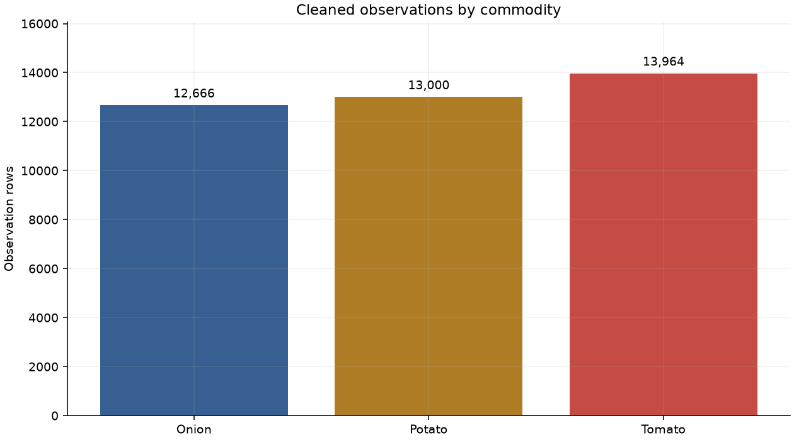
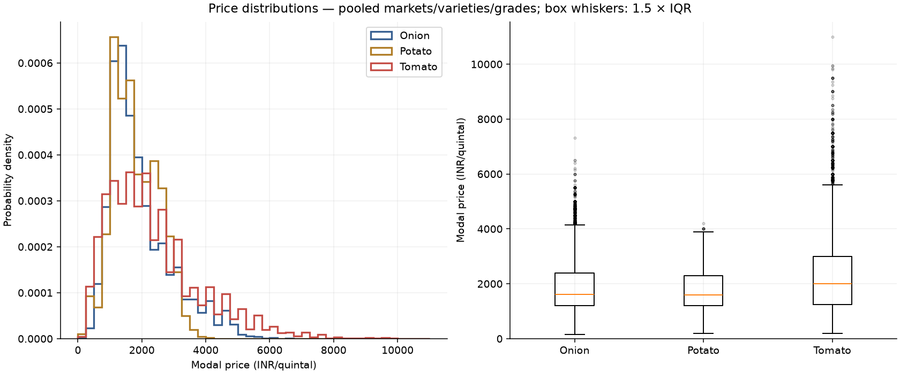
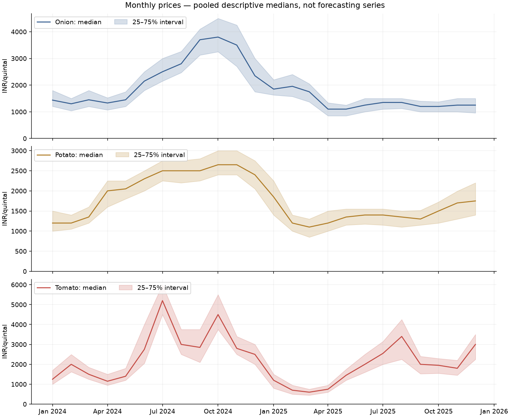
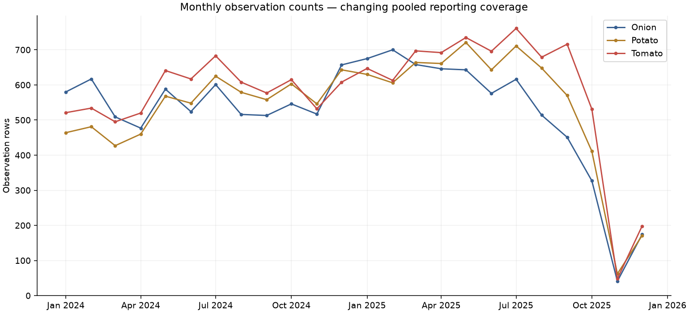
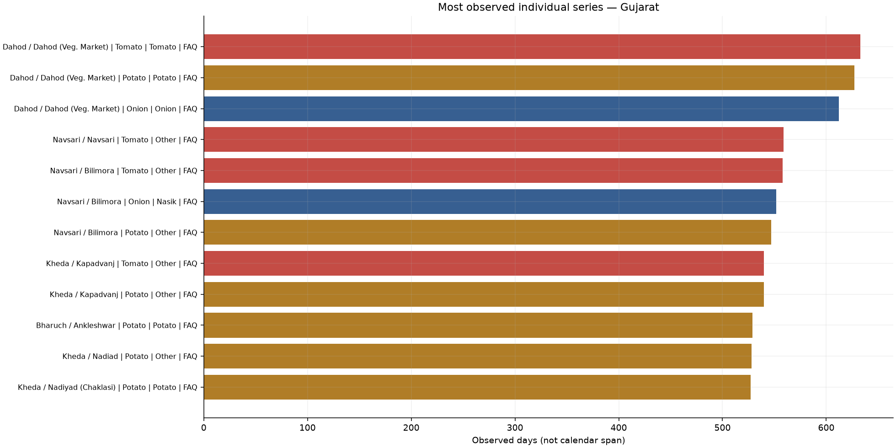
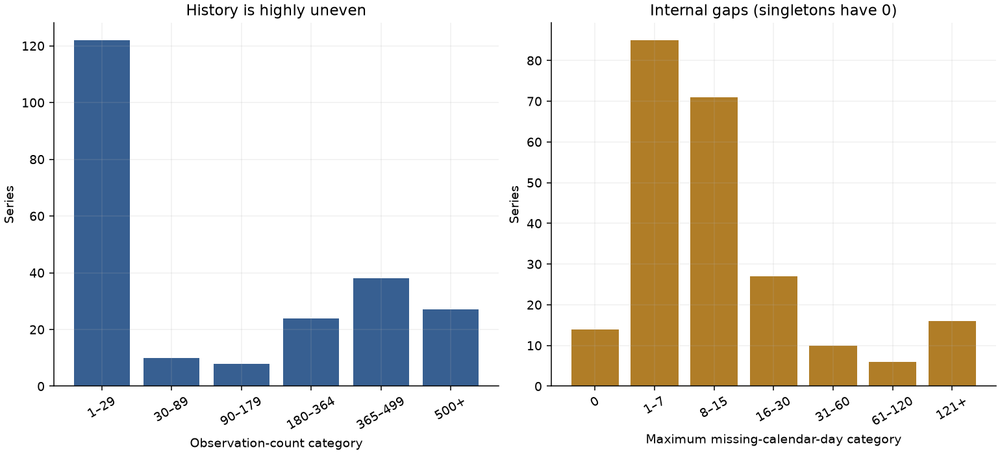
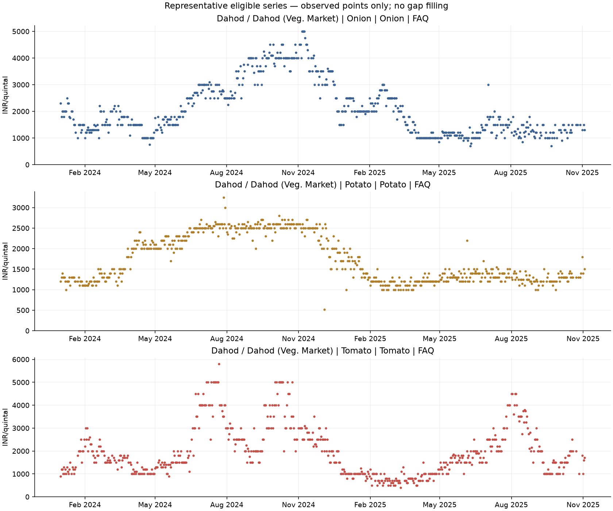
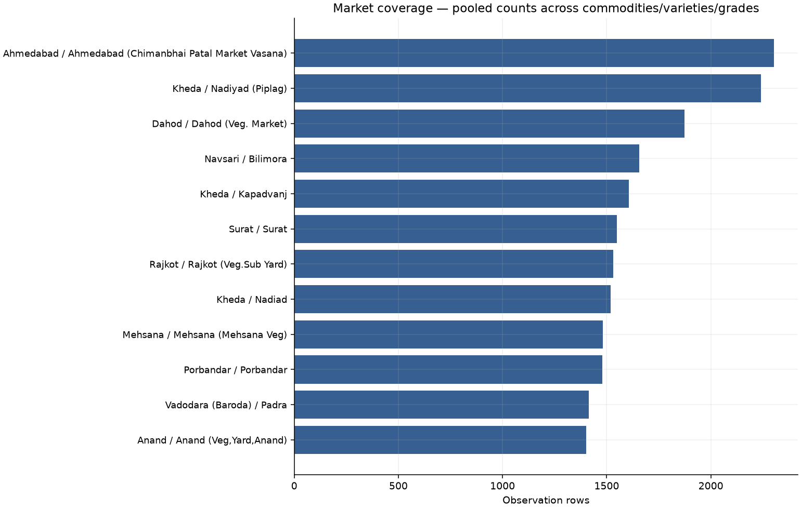
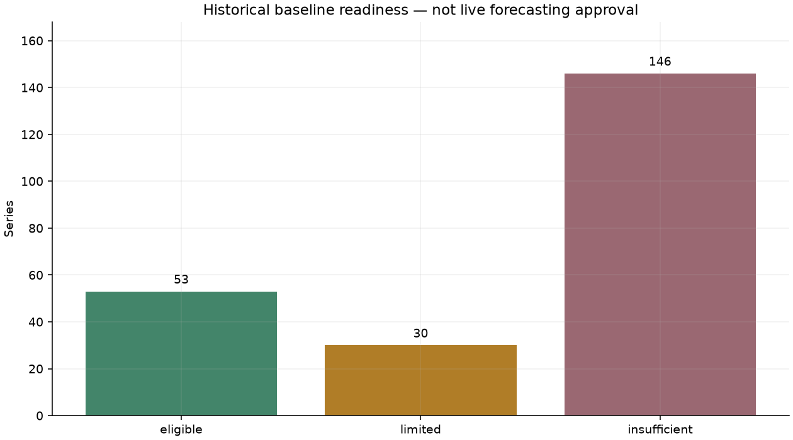
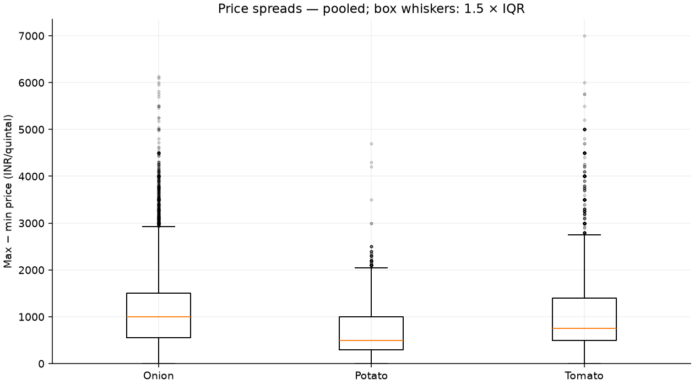

# Day 4: EDA and historical forecasting readiness

Krishkumar | 2401CS83 | IIT Patna

Repository: https://github.com/Krish290107/agrisense

## Dataset and integrity

39,630 observations; 229 exact six-field series; 81 district-market combinations; 22 districts; 16 varieties; 6 grades. Dates: 2024-01-01–2025-12-29 across 704 observed dates. Modal price is the future target, in INR/quintal. Input hash matches the Day 3 summary. Date/identity/price/unit/duplicate checks pass; EDA never rewrites inputs.

## Commodity prices

| Commodity | Rows | Markets | Series | Median | IQR | Std | Median spread |
| --- | --- | --- | --- | --- | --- | --- | --- |
| Onion | 12666 | 57 | 80 | 1607.5 | 1195.0 | 979.8 | 1000.0 |
| Potato | 13000 | 50 | 71 | 1600.0 | 1100.0 | 699.6 | 500.0 |
| Tomato | 13964 | 61 | 78 | 2000.0 | 1750.0 | 1444.1 | 750.0 |

All price statistics above are pooled observation-weighted descriptions: markets, varieties and grades differ. They are not comparable investment returns or Gujarat-wide forecast targets. Full count/mean/median/std/min/quartile/max statistics are in eda_summary.json. Series-relative IQR/CV are in series_readiness.csv; singleton standard deviation/CV is undefined, not zero.

## Monthly patterns and coverage composition

- Onion: pooled monthly median low 1,100.0 in 2025-04; high 3,800.0 in 2024-10. 694 distinct observed dates; 28 series-relative flags.

- Potato: pooled monthly median low 1,100.0 in 2025-03; high 2,650.0 in 2024-10. 699 distinct observed dates; 17 series-relative flags.

- Tomato: pooled monthly median low 600.0 in 2025-03; high 5,200.0 in 2024-07. 702 distinct observed dates; 43 series-relative flags.

Monthly medians and IQR bands show observed variation, not established long-term seasonality. Approximately two source years, changing market/grade mix and incomplete series histories confound pooled comparisons. series_monthly.csv permits same-identity checks; no month-of-year average is treated as a seasonal model.

## Markets and series coverage

| district | market | observations | commodities | eligible_series | span_days |
| --- | --- | --- | --- | --- | --- |
| Ahmedabad | Ahmedabad (Chimanbhai Patal Market Vasana) | 2303 | 2 | 2 | 674 |
| Kheda | Nadiyad (Piplag) | 2241 | 3 | 3 | 674 |
| Dahod | Dahod (Veg. Market) | 1873 | 3 | 3 | 674 |
| Navsari | Bilimora | 1657 | 3 | 3 | 665 |
| Kheda | Kapadvanj | 1606 | 3 | 3 | 672 |
| Surat | Surat | 1549 | 3 | 3 | 673 |
| Rajkot | Rajkot (Veg.Sub Yard) | 1531 | 3 | 3 | 675 |
| Kheda | Nadiad | 1518 | 3 | 2 | 674 |

Market counts/spans above pool separate identities and do not imply continuous forecasting history. market_summary.csv includes all markets (including sparse ones); market_commodity_prices.csv compares median/IQR/spread by commodity, still pooling varieties/grades. Rank individual series using series_readiness.csv.

Longest pooled market spans: Anand / Anand (Veg,Yard,Anand): 675 days; Bhavnagar / Mahuva (Station Road): 675 days; Gir Somnath / Talalagir: 675 days. Sparse markets: Bhavnagar / Bhavnagar APMC: 1 rows; Mehsana / Visnagar: 1 rows; Patan / Patan (Veg,Yard Patan) APMC: 1 rows.

Median series: 14 observations, 122-day span, 50.0% density. Maximum history is 675 days; no full two-year same-series history. Median of series maximum gaps is 8 days; largest internal gap is 425 missing calendar days. Gaps may be closures or non-reporting. Singleton density can be 100% and maximum gap 0, so density alone is not readiness.

## Readiness criteria and candidates

Eligible: at least 365 observations, 600-day span, 50% density, maximum 45-day internal missing gap, and last observation within 60 days of dataset end. Limited: at least 90 observations, 180-day span, 25% density, maximum 90-day gap and recency within 180 days, but fails eligible criteria. Otherwise insufficient. These are screening choices, not accuracy guarantees.

The distribution supports reusing Day 2's explicitly shorter-history screen: median count is only 14, while the upper quartile is 424. Recency sensitivity with the other eligible thresholds fixed: 30 days → 0, 60 → 53, 90 → 63. The 60-day choice accommodates the observed late-2025 reporting change without merging labels. Recency reference is 2025-12-29, not today's date; this dataset does not authorize live predictions.

Readiness: **53 eligible, 30 limited, 146 insufficient**. Each row has explicit reasons. Eligible counts leave room for chronological evaluation, but calendar-aligned horizons and actual split feasibility still require Day 5 checks; no splits/features were made today.

| Series (Gujarat) | Days | Span | Density | Max gap | Last |
| --- | --- | --- | --- | --- | --- |
| Dahod / Dahod (Veg. Market) / Onion / Onion / FAQ | 612 | 674 | 90.8% | 4 | 2025-11-04 |
| Navsari / Bilimora / Onion / Nasik / FAQ | 552 | 665 | 83.0% | 18 | 2025-11-05 |
| Kheda / Kapadvanj / Onion / Other / FAQ | 526 | 672 | 78.3% | 9 | 2025-11-04 |
| Dahod / Dahod (Veg. Market) / Potato / Potato / FAQ | 627 | 673 | 93.2% | 3 | 2025-11-03 |
| Navsari / Bilimora / Potato / Other / FAQ | 547 | 665 | 82.3% | 18 | 2025-11-05 |
| Kheda / Kapadvanj / Potato / Other / FAQ | 540 | 671 | 80.5% | 12 | 2025-11-04 |
| Dahod / Dahod (Veg. Market) / Tomato / Tomato / FAQ | 633 | 673 | 94.1% | 3 | 2025-11-03 |
| Navsari / Bilimora / Tomato / Other / FAQ | 558 | 665 | 83.9% | 18 | 2025-11-05 |
| Navsari / Navsari / Tomato / Other / FAQ | 559 | 673 | 83.1% | 7 | 2025-11-05 |

Candidate selection: up to three per commodity, ranked by density, observation count, recency, gap then exact identity, using eligible rows only. These are historical baseline candidates; do not extrapolate across stale endpoints or relabeled markets.

## Variability, spreads and unusual observations

Series-relative outer IQR fences flagged 88 observations in 19 series; 106 series had ≥30 observations and positive IQR, while 123 were not screened. These are unusual values, not proven errors; nothing is deleted. Full-history descriptive thresholds must not be reused as training-time features or preprocessing rules. Local flagged rows retain exact identities and source references.

| Series | CV | IQR |
| --- | --- | --- |
| Gandhinagar / Kalol (Veg,Market,Kalol) / Tomato / Other / FAQ | 0.747 | 1250.0 |
| Anand / Anand (Veg,Yard,Anand) / Tomato / Other / FAQ | 0.672 | 1700.0 |
| Amreli / Damnagar / Tomato / Local / FAQ | 0.662 | 2862.5 |

| Series | Date | Modal |
| --- | --- | --- |
| Gir Somnath / Talalagir / Tomato / Other / FAQ | 2024-07-13 | 11000.0 |
| Gir Somnath / Talalagir / Tomato / Other / FAQ | 2024-07-12 | 9500.0 |
| Morbi / Vankaner (Sub yard) / Tomato / Other / FAQ | 2024-02-09 | 9500.0 |

Price spread (max minus min) is descriptive only; commodity/market/monthly spread summaries are supplied. Large spreads and CV may reflect market composition or genuine movements. No same-day min/max/spread is proposed as a future forecasting feature. Standard boxplot whiskers use 1.5×IQR and their dots differ from the stricter within-series 3×IQR audit flags.

## Figures

## Limits and Day 5 handoff

Preserve every district, market, commodity, variety and grade; FAQ and Non-FAQ remain separate. Missing dates are not zero prices and are never filled. Arrivals are absent. Label changes are not verified equivalences. All findings are retrospective; outlier fences and candidate selection use the available full history, so later evaluation must disclose this selection and fit any model/preprocessing only on its training window. Day 5 should compare simple chronological baselines on the candidate series, define observation-step versus calendar-day horizons explicitly, and verify usable holdout coverage before scoring.
