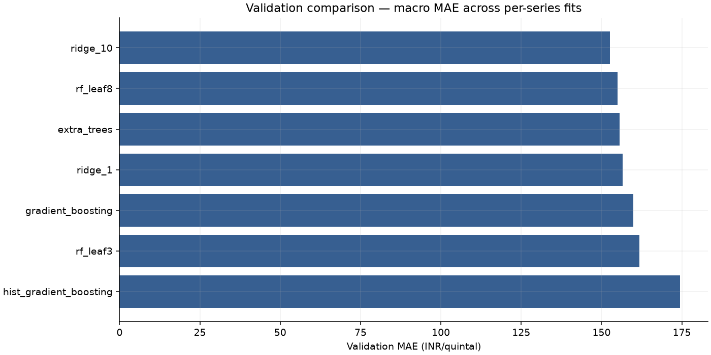
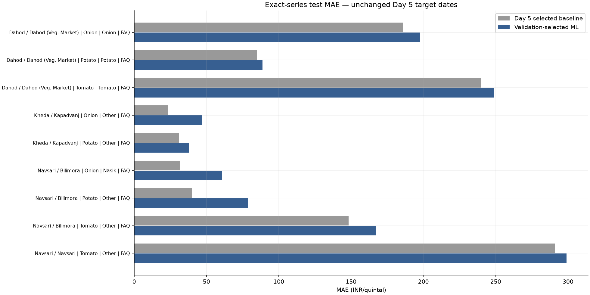
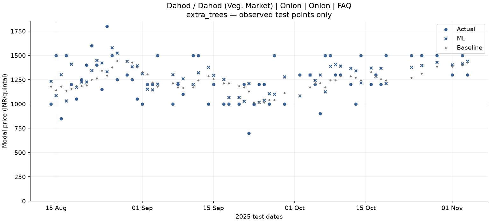
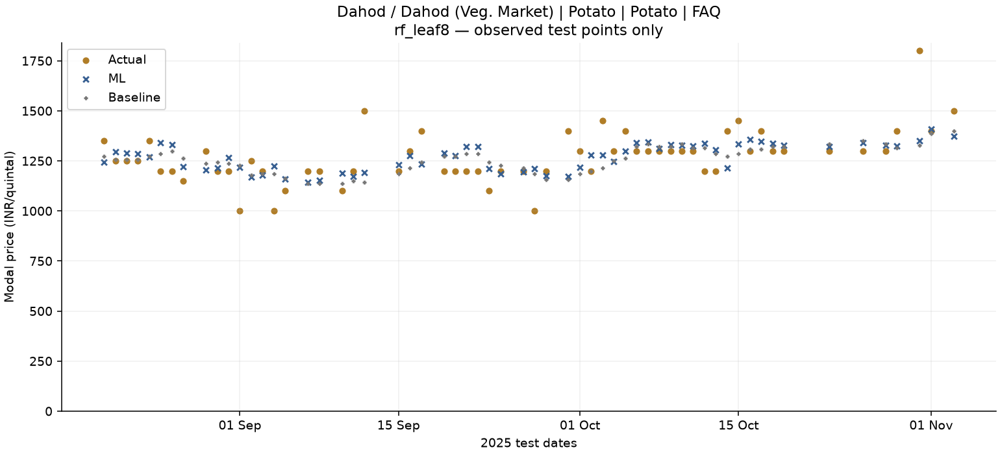
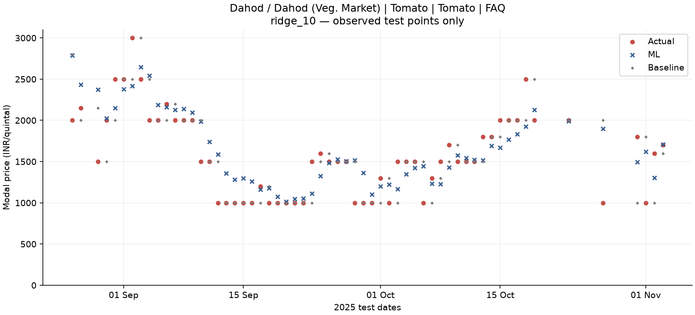
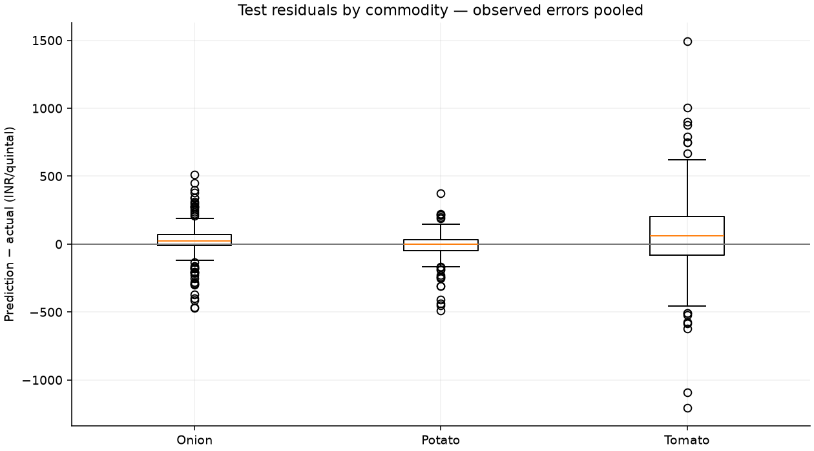
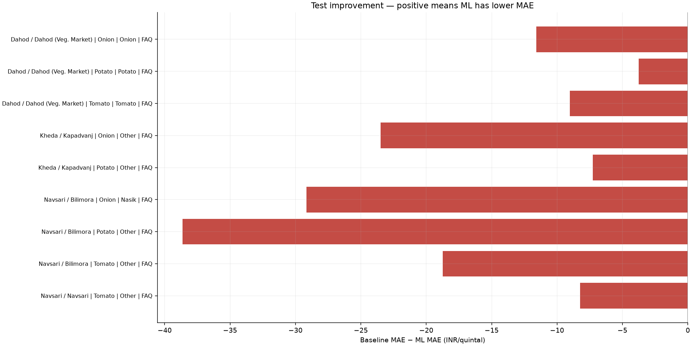
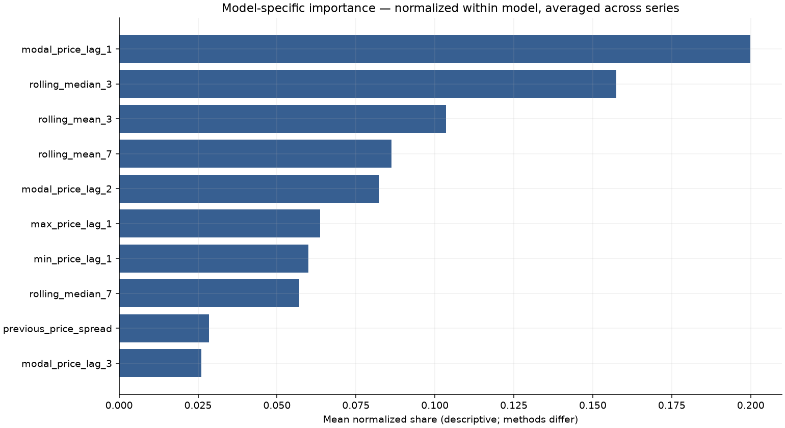
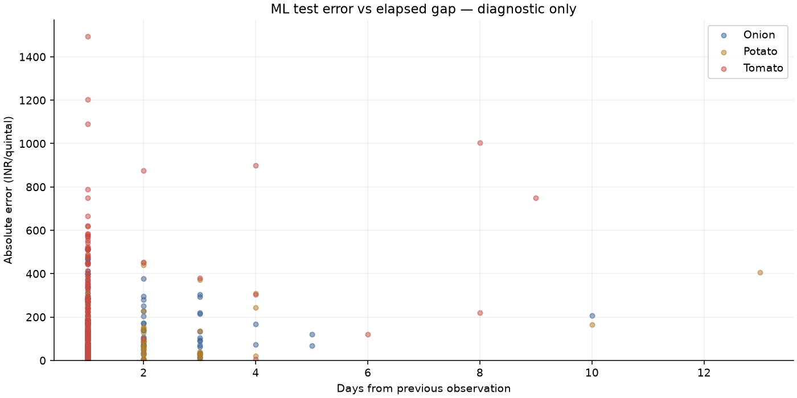

# Day 7: ML training, validation and baseline comparison

Krishkumar | 2401CS83 | IIT Patna

Repository: https://github.com/Krish290107/agrisense

## Design and availability

All 27 Day 6 features were checked. Only the 21 historical-only numeric features are used, plus six identity columns encoded inside each pipeline. The six target-date features depend only on dates, not target-day prices, but the next reporting date is not proven knowable operationally. Excluding them preserves Day 5's unknown-next-date information contract. No target, date, split, raw current min/max, benchmark errors or benchmark predictions enter the model.

Separate models are selected per exact series. A single pooled model using all nominal TRAIN rows would see outcomes later than the earliest validation origins; using all validation rows for global selection would also see outcomes after some test origins. Inspection found cross-series temporal overlap. Per-series selection preserves all 4,011 train, 540 validation and 540 test rows without moving boundaries or sharing future outcomes across markets. A synchronized global experiment is deferred; no superiority over global modeling is claimed.

Seven fixed configurations from five families: Ridge alpha 1/10; Random Forest 100 trees, depth 6, leaves 3/8; Extra Trees 100 trees, depth 6, leaf 3; Gradient Boosting 100 trees, rate .05, depth 2, leaf 8; HistGradientBoosting 100 iterations, rate .05, 15 leaves, minimum leaf 15, L2=1, early stopping disabled. Seed 42; one thread. No random cross-validation, target transform, clipping or imputation. Ridge scales numeric inputs; trees do not. OneHotEncoder(handle_unknown='ignore') fits on allowed data only; identity categories are constant within each local model, not arbitrary numeric IDs.

## Validation-only selection

| Series | Config | Train MAE | Validation MAE | Validation RMSE |
| --- | --- | --- | --- | --- |
| Dahod / Dahod (Veg. Market) / Onion / Onion / FAQ | extra_trees | 137.09 | 226.93 | 315.44 |
| Dahod / Dahod (Veg. Market) / Potato / Potato / FAQ | rf_leaf8 | 88.76 | 99.78 | 121.21 |
| Dahod / Dahod (Veg. Market) / Tomato / Tomato / FAQ | ridge_10 | 260.25 | 351.13 | 441.24 |
| Kheda / Kapadvanj / Onion / Other / FAQ | ridge_10 | 92.04 | 31.09 | 57.05 |
| Kheda / Kapadvanj / Potato / Other / FAQ | ridge_1 | 38.71 | 16.32 | 24.44 |
| Navsari / Bilimora / Onion / Nasik / FAQ | rf_leaf8 | 95.83 | 48.32 | 77.27 |
| Navsari / Bilimora / Potato / Other / FAQ | rf_leaf3 | 52.69 | 16.79 | 34.3 |
| Navsari / Bilimora / Tomato / Other / FAQ | ridge_10 | 168.85 | 272.45 | 405.99 |
| Navsari / Navsari / Tomato / Other / FAQ | ridge_10 | 190.39 | 265.48 | 455.79 |

Selected configurations have macro validation MAE 147.59 and mean per-series RMSE 214.75 INR/quintal. Full validation scores and training errors are in ml_validation_scores.csv. Selection uses per-series validation MAE, then RMSE, then fixed configuration order. Training errors are optimistic in-sample diagnostics, not forecasts. Large train/validation gaps should be revisited in Day 8, not used to retune after test inspection.

Selection was recomputed deterministically using TRAIN and VALIDATION only and frozen in ml_selection.json before test evaluation. Each chosen pipeline was refitted on its own train+validation rows (4,551 total); all fit dates precede that series' first test target. Weights are then fixed during the 60-record test, while historical feature values update with previously observed actual prices. This is one observed step ahead, not recursive multi-day forecasting. Day 5 baselines update their historical formulas each step; this refit-frequency difference is explicit.

## Does ML beat the baselines?

ML macro test MAE **136.20** versus Day 5 **119.55** INR/quintal: absolute improvement **-16.65**, percentage improvement **-13.93%**. ML wins 0/9, baseline wins 9/9, ties 0/9. Negative improvement means ML is worse. All selected ML models are evaluated, even when the baseline remains better; no post-test switching is performed.

Macro median MAE 88.75, mean per-series RMSE 192.70. Pooled MAE/RMSE/sMAPE: 136.20 / 225.51 / 8.69%. Macro metrics weight series equally; pooled metrics weight observations equally (60 per series here). MAE/RMSE are INR/quintal; sMAPE uses the same 0–200% definition as Day 5.

| Series | Baseline | Baseline MAE | ML MAE | Improvement % | Winner |
| --- | --- | --- | --- | --- | --- |
| Dahod / Dahod (Veg. Market) / Onion / Onion / FAQ | rolling_mean_7 | 185.95 | 197.54 | -6.23 | baseline |
| Dahod / Dahod (Veg. Market) / Potato / Potato / FAQ | rolling_mean_7 | 85.0 | 88.75 | -4.41 | baseline |
| Dahod / Dahod (Veg. Market) / Tomato / Tomato / FAQ | naive | 240.0 | 249.01 | -3.76 | baseline |
| Kheda / Kapadvanj / Onion / Other / FAQ | naive | 23.33 | 46.81 | -100.63 | baseline |
| Kheda / Kapadvanj / Potato / Other / FAQ | naive | 30.83 | 38.09 | -23.53 | baseline |
| Navsari / Bilimora / Onion / Nasik / FAQ | naive | 31.67 | 60.82 | -92.06 | baseline |
| Navsari / Bilimora / Potato / Other / FAQ | naive | 40.0 | 78.63 | -96.57 | baseline |
| Navsari / Bilimora / Tomato / Other / FAQ | naive | 148.33 | 167.07 | -12.63 | baseline |
| Navsari / Navsari / Tomato / Other / FAQ | naive | 290.83 | 299.06 | -2.83 | baseline |

## Commodity and residual diagnostics

| commodity | ml_mae | baseline_mae | improvement | mean_signed_error |
| --- | --- | --- | --- | --- |
| Onion | 101.724 | 80.317 | -21.406 | 25.703 |
| Potato | 68.49 | 51.944 | -16.545 | -15.131 |
| Tomato | 238.381 | 226.389 | -11.992 | 77.111 |

Tomato-specific comparisons above retain genuine sharp moves. Positive signed error means overprediction; negative means underprediction. ml_error_examples.csv includes the largest three errors per series, and ml_error_diagnostics.csv reports commodity-specific gap and historical-volatility buckets. The volatility cutoff is each series' TRAIN median rolling_std_7, never a test-chosen threshold. Sample counts and mix confound bucket comparisons; diagnostics do not establish causation and were not used for tuning.

## Explanatory importance

| feature | normalized_share |
| --- | --- |
| modal_price_lag_1 | 0.1999 |
| rolling_median_3 | 0.1574 |
| rolling_mean_3 | 0.1035 |
| rolling_mean_7 | 0.0863 |
| modal_price_lag_2 | 0.0824 |

Importance uses fitted tree impurity or absolute Ridge coefficients (numeric inputs standardized), normalized per model and averaged across nine series. HistGradientBoosting lacks native importance; if selected, deterministic validation permutation importance uses a separate training-only fit of the already frozen configuration. Negative permutation values are truncated only for normalized explanatory shares. Methods and correlated features limit comparisons; none is causal or used for feature selection. No test targets are used for importance.

## Artifacts and reproduction

Run `.\.venv\Scripts\python.exe scripts/train_models.py`. Existing completed results are verified and reused without selecting/refitting/rescoring test again. The local ml/models/agrisense_price_model.joblib bundle contains every exact-series preprocessing+regression pipeline and routing identity. Model metadata records configuration, schema, counts, hashes, versions, seed and scores. Predictions stay in reports/data/local/ml_test_predictions.csv. Model reload reproduces all final predictions within numeric tolerance. Changed inputs/code/configuration refuse silent overwrite; a future experiment must be separately reviewed/versioned.

## Figures

## Limits and Day 8

Although Day 7 does not use test outcomes for fitting or selection, these dates were already analyzed in Days 4/5; they are not a pristine project-wide untouched holdout. The cohort was selected retrospectively, and model-development decisions in this project have seen earlier benchmark reports. Claims of unbiased future generalization require fresh data. Only nine strong candidates, fewer than two years per identity, stale endpoints and unknown release/revision timing further limit applicability. Prior prices are assumed available by the next observation; no weather, arrivals, demand or event data are used. Features lose seven warm-up training rows per series, while baselines retain that context. No production readiness, live forecast API or deployment is claimed. Day 8 should examine robustness and validation-supported choices without silently optimizing this reused test set.
